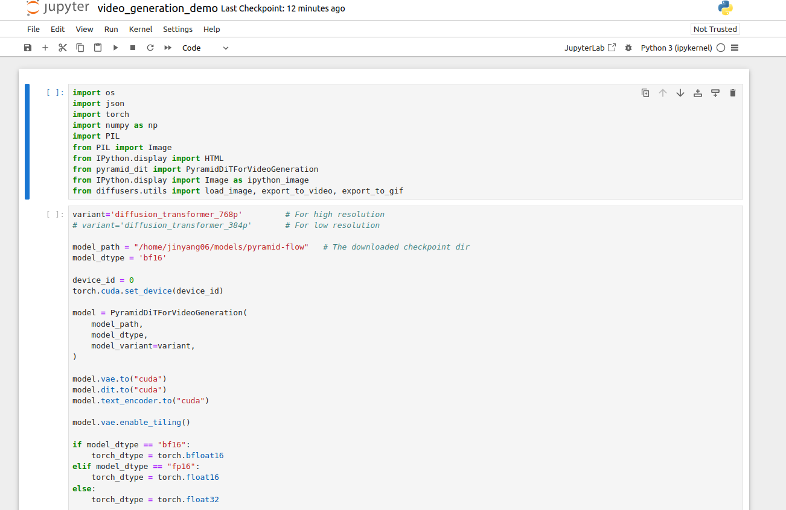

# PyramidFlow (GenAI) with a GPU Docker

The PyramidFlow project focuses on video generation using a pyramidal flow-matching technique, designed for training efficiency. It aims to create realistic, high-quality video content through an autoregressive approach that incrementally refines video frames in a multi-level, pyramid-like structure. The project showcases examples like cinematic scenes, nature shots, and detailed movements, highlighting its ability to generate both simple and complex scenarios from text or image inputs. 


# How to run

We create the environments in Miniconda and Docker. The conda "pyramid" env builds TensorFlow, PyTorch, Huggingface and Python-v3.8 under the CUDA Docker (nvidia/cuda:12.2.0-base-ubuntu22.04). This structure makes us easily possible to use local GPUs.


```
docker-compose -f docker-compose_pyramidflow.yml build

docker-compose -f docker-compose_pyramidflow.yml up
```

Then, connect to the local Jupyter notebook (http://127.0.0.1:8888).




# Forked branch

* Pyramid-Flow - commit: fa4e1e52f71a46beb8bb29d1d3252232f3a47821 in "main" branch.


# TODO

* Run and test the video generation in a GPU with less memory (8GB)
* Update some scripts


# Reference

* https://huggingface.co/rain1011/pyramid-flow-sd3

* https://huggingface.co/spaces/Pyramid-Flow/pyramid-flow

* https://pyramid-flow.github.io/

* https://github.com/jy0205/Pyramid-Flow

* https://www.youtube.com/watch?v=9lnVxRZ0cBs&t=3s

